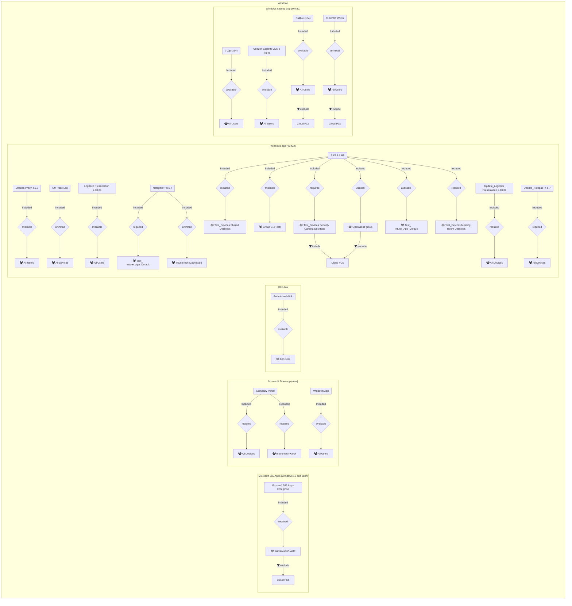
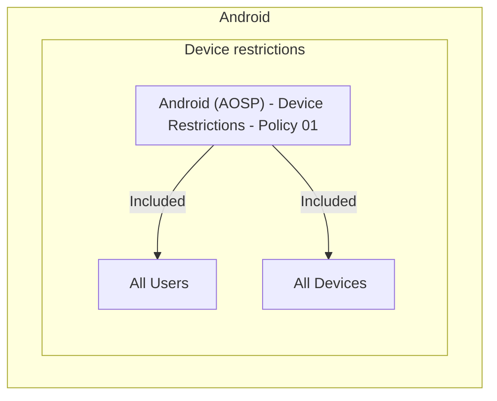

# Overview


This module was created to generate diagrams on [Mermaid](https://mermaid.js.org/) format for Intune assignments of profiles and applications.

## Installing the module from PSGallery
The IntuneMermaid module is published to the PowerShell Gallery. Install it on your system by running the following in a PowerShell console:
```PowerShell
Install-Module -Name "IntuneMermaid"
```

## Using the module

The module provides the `New-IntuneMermaidGraph` function (alias `New-IMG`) to generate Mermaid.js flowcharts for Intune applications or profiles. Below are the parameters supported by the function:

### Parameters

#### **Type**
- **Description**: Specifies the type of resource on Intune to generate the flowchart for.
- **Valid Values**: `Applications`, `Profiles`
- **Default**: `Applications`

#### **GroupBy**
- **Description**: Specifies the grouping criteria for the flowchart to display.
- **Valid Values**: 
  - `Name`: Groups by Applications/Profiles Name
  - `Assignments`: Groups by Entra ID groups names they are assigned to
- **Default**: `Name`

#### **OperatingSystem**
- **Description**: Specifies the operating systems to include in the flowchart.
- **Valid Values**: `Windows`, `macOS`, `iOS`, `Android`
- **Default**: Includes all operating systems (`Windows`, `macOS`, `iOS`, `Android`)

#### **Direction**
- **Description**: Specifies the direction of the flowchart.
- **Valid Values**: 
  - `TB` (Top to Bottom)
  - `TD` (Top Down)
  - `BT` (Bottom to Top)
  - `LR` (Left to Right)
  - `RL` (Right to Left)
- **Default**: `TB`

#### **DisplayIcons**
- **Description**: Specifies whether to download and display icons for applications from Intune in the flowchart.
- **Valid Values**: `$True`, `$False`
- **Default**: `$True`

#### **PolicyType** (Dynamic Parameter)
- **Description**: Dynamic parameter that only appears when `Type` is set to `Profiles`. Allows filtering of configuration profiles by type.
- **Valid Values**: Includes values like `Device restrictions`, `Endpoint protection`, `Administrative templates`, etc.
- **Default**: (`Administrative templates`, `App configuration`, `Custom`, `Derived credentials`,
				`Device features`, `Device firmware`, `Device restrictions`, `Delivery optimization`,
				`Domain join`, `Edition upgrade`, `Education`, `Email`, `Endpoint protection`,
				`Expedited check-in`, `Extensions`, `Hardware configurations`, `IKEv2 VPN`,
				`Identity protection`, `Information protection`, `Kiosk`, `Microsoft Defender for Endpoint`,
				`Network boundary`, `OMA-CP`, `PFX certificate`, `PKCS certificate`,
				`Policy override`, `Preference file`, `Presets`, `SCEP certificate`, 
				`Secure assessment (Education)`, `Settings Catalog`, `Shared multi-user device`, `Teams device restrictions`,
				`Trusted certificate`, `Unsupported`, `Update Configuration`, `Update rings for Windows updates`,
				`VPN`, `Wi-Fi`, `Wi-Fi import`, `Windows health monitoring`, `Wired network`)

#### **ApplicationType** (Dynamic Parameter)
- **Description**: Appears only when `Type` is set to `Applications`. Allows filtering of applications by their application type.
- **Valid Values**: Includes values like `Windows app (Win32)`, `iOS store app`, `Android store app`, etc.
- **Default**: (`Android Enterprise system app`, `Managed Google Play store app`,
				`Android line-of-business app`, `Android store app`, `Built-In Android app`,
				`iOS/iPadOS web clip`, `iOS line-of-business app`, `iOS store app`,
				`iOS volume purchase program app`, `macOS app (DMG)`, `macOS line-of-business app`,
				`Microsoft Defender ATP (macOS)`, `Microsoft Edge (macOS)`, `macOS Office Suite`,
				`macOS app (PKG)`, `macOS volume purchase program app`, `macOS web clip`,
				`Managed iOS store app`, `Microsoft 365 Apps (Windows 10 and later)`, `Web link`,
				`Windows catalog app (Win32)`, `Windows app (Win32)`, `Microsoft Store app (new)`,
				`Microsoft Edge (Windows 10 and later)`, `Windows MSI line-of-business app`,
				`Microsoft Store app (legacy)`, `Windows Universal AppX line-of-business app`, 
				`Windows web link`)

### Examples

#### 1 Generate a flowchart for applications grouped by assignments with icons displayed
```PowerShell
New-IntuneMermaidGraph -Type "Applications" -GroupBy "Assignments" -DisplayIcons $True
```

[Example 1](https://mermaid.live/edit?code=https://gist.githubusercontent.com/schenardie/ea6367ab7884179e2270a9e77bdf15d9/raw/843eed7c9210b42cb4f737ed7d8cff5d273eb4ca/example1.mmd&config=https://gist.githubusercontent.com/schenardie/21bd43722e8bff24f4ad242ecdae0242/raw/2df9a366ef7c262c7eed6bea2b1ae49e5220de16/config.json)

[Example 1 using ELK layout](https://mermaid.live/edit?code=https://gist.githubusercontent.com/schenardie/ea6367ab7884179e2270a9e77bdf15d9/raw/843eed7c9210b42cb4f737ed7d8cff5d273eb4ca/example1.mmd&config=https://gist.githubusercontent.com/schenardie/f73d216eaedf581d1b47fb58c05d4d01/raw/c7d52a4df013772590157673f383e62118f531eb/configelk.json)

#### 2 Generate a flowchart for profiles in a left-to-right layout
```PowerShell
New-IntuneMermaidGraph -Type "Profiles" -Direction "LR"
```

[Example 2](https://mermaid.live/edit?code=https://gist.githubusercontent.com/schenardie/83250b1983785e093dc57fbf942aba86/raw/916ba76252a84033dc598f2802f4f191f25fdbd5/example2.mmd&config=https://gist.githubusercontent.com/schenardie/21bd43722e8bff24f4ad242ecdae0242/raw/2df9a366ef7c262c7eed6bea2b1ae49e5220de16/config.json)

#### 3 Generate a flowchart for Windows applications only, with no icons
```PowerShell
New-IntuneMermaidGraph -Type "Applications" -OperatingSystem "Windows" -DisplayIcons $False
```
[Example 3](https://mermaid.live/edit?code=https://gist.githubusercontent.com/schenardie/0e18741beda8f12db9fbe9c8f4da5279/raw/b4268ec872441aa6ffafd02ea2cc64824abe135f/Example3.mmd&config=https://gist.githubusercontent.com/schenardie/21bd43722e8bff24f4ad242ecdae0242/raw/2df9a366ef7c262c7eed6bea2b1ae49e5220de16/config.json)

Example 3 Embedded


#### 4 Generate a flowchart for specific application types only
```PowerShell
New-IntuneMermaidGraph -Type "Applications" -ApplicationType "Windows app (Win32)", "Microsoft 365 Apps (Windows 10 and later)"
```

[Example 4](https://mermaid.live/edit?code=https://gist.githubusercontent.com/schenardie/387c3a308d8a8f9befd224253087022b/raw/5d42daa117ce4a15862898f1ae4e8ec8c234cd95/example4.mmd&config=https://gist.githubusercontent.com/schenardie/21bd43722e8bff24f4ad242ecdae0242/raw/2df9a366ef7c262c7eed6bea2b1ae49e5220de16/config.json)


[Example 4 using elk layout](https://mermaid.live/edit?code=https://gist.githubusercontent.com/schenardie/387c3a308d8a8f9befd224253087022b/raw/5d42daa117ce4a15862898f1ae4e8ec8c234cd95/example4.mmd&config=https://gist.githubusercontent.com/schenardie/f73d216eaedf581d1b47fb58c05d4d01/raw/c7d52a4df013772590157673f383e62118f531eb/configelk.json)

#### 5 Generate a flowchart for iOS device restriction profiles only
```PowerShell
New-IntuneMermaidGraph -Type "Profiles" -OperatingSystem "Android" -PolicyType "Device restrictions"
```

Example 5 Embedded



#### 6 Generate a flowchart of profiles grouped by assignment groups for Android and iOS only
```PowerShell
New-IntuneMermaidGraph -Type "Profiles" -GroupBy "Assignments" -OperatingSystem @("Android", "iOS")
```
[Example 6](https://mermaid.live/edit?code=https://gist.githubusercontent.com/schenardie/f8e3a283502801c7f41fb8ddb54528c9/raw/6b43fc5a5b6465d1dae50574694b7e16ff5e8014/example6.mmd&config=https://gist.githubusercontent.com/schenardie/21bd43722e8bff24f4ad242ecdae0242/raw/2df9a366ef7c262c7eed6bea2b1ae49e5220de16/config.json)